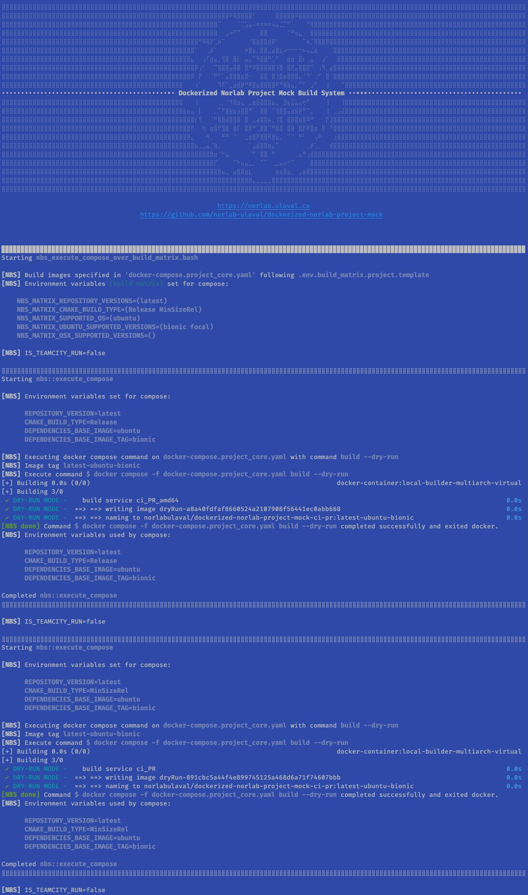
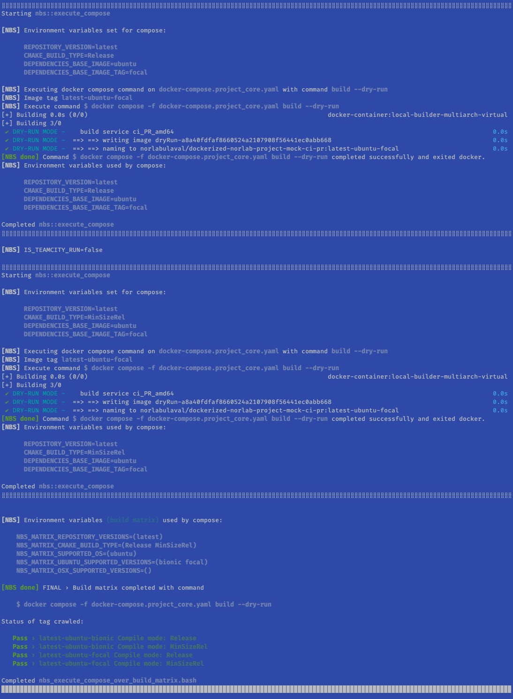
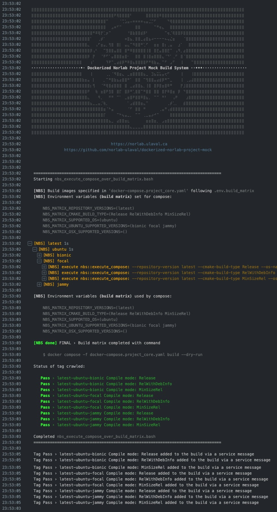

<div align="center">

[//]: # ( ==== Logo ================================================== )
<br>
<br>
<a href="https://norlab.ulaval.ca">
    <picture>
      <source media="(prefers-color-scheme: dark)" srcset="/visual/norlab_logo_acronym_light.png">
      <source media="(prefers-color-scheme: light)" srcset="/visual/norlab_logo_acronym_dark.png">
      
    </picture>
</a>
<br>
<br>

[//]: # ( ==== Title ================================================= )
# _Norlab Build System (NBS)_

[//]: # ( ==== Hyperlink ============================================= )
<sup>
<a href="http://132.203.26.125:8111">NorLab TeamCity GUI</a>
(VPN/intranet access) &nbsp; • &nbsp;
<a href="https://hub.docker.com/repositories/norlabulaval">norlabulaval</a>
(Docker Hub) &nbsp;
</sup>
<br>
<br>


[//]: # ( ==== Description =========================================== )
**`NBS` is a build-infrastructure-agnostic build system custom-made 
<br>
to meet our need in robotic software engineering at NorLab.**
<br>
<br>

[//]: # ( ==== Badges ================================================ )
[](https://github.com/semantic-release/semantic-release)

<a href="http://132.203.26.125:8111"></a>

<br>

[//]: # ( ==== Maintainer ============================================ )
<sub>
Maintainer <a href="https://redleader962.github.io">Luc Coupal</a>
</sub>

<br>
<hr style="color:lightgray;background-color:lightgray">
</div>


[//]: # ( ==== Body ================================================== )
<details>
  <summary style="font-weight: bolder;font-size: large;"><b> Install instructions and git submodule usage notes </b></summary>

Just clone the *norlab-build-system* as a submodule in your project repository (ie the
_superproject_), in an arbitrary directory eg.: `my-project/build_system/utilities/`.

```bash
cd <my-project>
mkdir -p build_system/utilities

git submodule init

git submodule \
  add https://github.com/norlab-ulaval/norlab-build-system.git \
  build_system/utilities/norlab-build-system

# Traverse the submodule recursively to fetch any sub-submodule
git submodule update --remote --recursive --init

# Commit the submodule to your repository
git add .gitmodules
git add build_system/utilities/norlab-build-system
git commit -m 'Added norlab-build-system submodule to repository'
```

### Notes on submodule

To **clone** your repository and its submodule at the same time, use

```bash
git clone --recurse-submodules <project/repository/url>
```

Be advise, submodules are a snapshot at a specific commit of the *norlab-build-system*
repository. To **update the submodule** to its latest commit, use

```
[sudo] git submodule update --remote --recursive --init [--force]
```

Notes:

- Add the `--force` flag if you want to reset the submodule and throw away local changes to it.
  This is equivalent to performing `git checkout --force` when `cd` in the submodule root
  directory.
- Add `sudo` if you get an error such
  as `error: unable to unlink old '<name-of-a-file>': Permission denied`

To set the submodule to **point to a different branch**, use

```bash
cd <the/submodule/directory>
git checkout the_submodule_feature_branch_name
```

and use the `--recurse-submodules` flag when switching branch in your main project

```bash
cd <your/project/root>
git checkout --recurse-submodules the_feature_branch_name
```

---

### Commiting to submodule from the main project (the one where the submodule is cloned)

#### If you encounter `error: insufficient permission for adding an object to repository database ...`

```shell
# Change the `.git/objects` permissions
cd <main/project/root>/.git/objects/
chown -R $(id -un):$(id -gn) *
#       <yourname>:<yourgroup>

# Share the git repository (the submodule) with a Group
cd ../../<the/submodule/root>/
git config core.sharedRepository group
# Note: dont replace the keyword "group"
```

This should solve the problem permanently.

</details>

---

#### `v0.*.*` release notes:

- Be advised, this is a early release, and we might introduce API breaking change in `v1`.
- This version is used in `libpointmatcher-build-system` and `libnabo-build-system`
- We are currently refactoring out the `dockerized-norlab` build-system logic
  to `norlab-build-system` for release `v1.0.0`. Stay tuned for the first stable release.

---

# NBS caracteristics
- **build infrastructure agnostic**: can be used locally or on any build infrastructure e.g. _TeamCity_, _GitHub workflow_ 
- support _**TeamCity**_ log via _teamcity service messages_: collapsable bloc, build tag, slack notifications ...
- **build/test isolation** using a _**Docker container**_ 
- portable
  - multi OS support (Ubuntu and OsX)
  - minimal dependencies: `docker`, `docker compose` and `docker buildx` for multi-architecture build
- simple to use
  - configuration through `.env` and `.env.build_matrix` files
  - convenient build script
  - convenient install script
- easy to update via _**git submodule**_

# NBS main usage
Note: Execute `cd src/utility_scripts && bash nbs_execute_compose_over_build_matrix.bash --help` for more details.

The main tool of this repository is a build matrix crawler named `nbs_execute_compose_over_build_matrix.bash`.
Assuming that the superproject (i.e. the project which have cloned `norlab-build-system` as a submodule) as the following structure,
`build_system/` would be containing all file required to run `nbs_execute_compose_over_build_matrix.bash` (i.e. `docker-compose.yaml`
, `Dockerfile`, `.env` and `.env.build_matrix`)

```shell
myCoolSuperProject
┣━━ src/
┣━━ test/
┣━━ build_system/
┃   ┣━━ my_superproject_dependencies_build_matrix_crawler.bash
┃   ┣━━ nbs_container
┃   ┃   ┣━━ Dockerfile.dependencies
┃   ┃   ┣━━ Dockerfile.project.ci_PR
┃   ┃   ┗━━ entrypoint.bash
┃   ┣━━ .env.build_matrix.dependencies
┃   ┣━━ .env.build_matrix.project
┃   ┣━━ .env
┃   ┣━━ docker-compose.dependencies.yaml
┃   ┗━━ docker-compose.project_core.yaml
┣━━ utilities/
┃   ┣━━ norlab-build-system/
┃   ┗━━ norlab-shell-script-tools/
┣━━ .git
┣━━ .gitmodules
┗━━ README.md
```

## Crawling a build matrix localy (on your workstation)

Assuming that 
- `.env.build_matrix.project` defining a build matrix `[latest] x [ubuntu] x [focal, jammy] x [Release, MinSizeRel]`,
- `my_superproject_dependencies_build_matrix_crawler.bash` is a custom script that import `NBS` such as in the following example

```shell
my_superproject_dependencies_build_matrix_crawler.bash

#!/bin/bash
# =======================================================================================
#
# Execute build matrix specified in '.env.build_matrix.dependencies'
#
# Redirect the execution to 'nbs_execute_compose_over_build_matrix.bash' 
#   from the norlab-build-system library
#
# Usage:
#   $ bash my_superproject_dependencies_build_matrix_crawler.bash [<optional flag>] [-- <any docker cmd+arg>]
#
#   $ bash my_superproject_dependencies_build_matrix_crawler.bash -- build --dry-run
#
# Run script with the '--help' flag for details
#
# ======================================================================================
PARAMS="$@"

# ....path resolution logic.............................................................
SPROJECT_ROOT="$(dirname "$(realpath "$0")")/.."
SPROJECT_BUILD_SYSTEM_PATH="${SPROJECT_ROOT}/build_system"
NBS_PATH="${SPROJECT_ROOT}/utilities/norlab-build-system"

# ....Load environment variables from file..............................................
cd "${SPROJECT_BUILD_SYSTEM_PATH}" || exit 1
set -o allexport && source .env && set +o allexport

# ....Source NBS dependencies...........................................................
cd "${NBS_PATH}" || exit 1
source import_norlab_build_system_lib.bash

# ====begin=============================================================================
cd "${NBS_PATH}/src/utility_scripts" || exit 1

DOTENV_BUILD_MATRIX_REALPATH=${SPROJECT_BUILD_SYSTEM_PATH}/.env.build_matrix.dependencies

# Note: do not double cote PARAMS or threat it as a array otherwise it will cause error
# shellcheck disable=SC2086
bash nbs_execute_compose_over_build_matrix.bash "${DOTENV_BUILD_MATRIX_REALPATH}" \
                      --fail-fast $PARAMS
                      
```

then invoking the crawler in your superproject

```shell
$ cd <path/to/my/superproject>
$ bash ./build_system/my_superproject_dependencies_build_matrix_crawler.bash
```
will result in the following build log 





## Crawling a build matrix on a build server

`NBS` is build infrastructure agnostic, meaning it can be run any unix system provided the dependencies are installed. 
We provide support for _Jetbrains TeamCity_ special features related to service messages, tag and slack notification as it's our build infrastructure of choice at NorLab.

### Crawling a build matrix on a _Jetbrains TeamCity_ build server

With `NBS` support for `##teamcity[blockOpened` and `##teamcityblockClosed` service messages which create
collapsable bloc in build logs, 
a larger build matrix such as `[latest] x [ubuntu] x [bionic, focal, jammy] x [Release, RelWithDebInfo, MinSizeRel]`
will result in an well-structured, easy to read build logs such as the following

Note: [-] and [+] are collapsible rows





# NBS shell script function/script library

- Most code in this repository is tested using _**bats-core**_ and _**docker compose config**_ (see [README.md](https://github.com/norlab-ulaval/norlab-build-system/blob/master/tests/README.md) in `tests/` for details)
- Most code is well documented: each script header and each function definition
- Go to `install_scripts` for installation-related script:
  - install docker tools
  - create multiarch docker builder
- Go to `build_system_templates/` for `docker-compose.yaml`, `Dockerfile`, `.env` and `.env.build_matrix` templates required to use
  `nbs_execute_compose_over_build_matrix.bash`
- Go to `src/utility_scripts` for utility script:
  - execute compose over build matrix
  - install python dev tools
  - run all test and dryrun in directory
- Go to `src/function_library` for shell script functions
  
### NBS library import

To use `NBS` as a library either in a script or in a shell, execute the following
```shell
cd <path/to/norlab-build-system>

bash import_norlab_build_system_lib.bash
# All `norlab-build-system` functions are now sourced in your current shell.
```
Note: `norlab-build-system` function are prefixed with `nbs`, i.e.: `nbs::<function_name>`

---

## [NBS test related tools ➚](https://github.com/norlab-ulaval/norlab-build-system/blob/master/tests/README.md)

---

### References:

#### Git Submodules

- [Git Tools - Submodules](https://git-scm.com/book/en/v2/Git-Tools-Submodules)
- [Git Submodules: Tips for JetBrains IDEs](https://www.stevestreeting.com/2022/09/20/git-submodules-tips-for-jetbrains-ides/)
- [Git submodule tutorial – from zero to hero](https://www.augmentedmind.de/2020/06/07/git-submodule-tutorial/)


---
